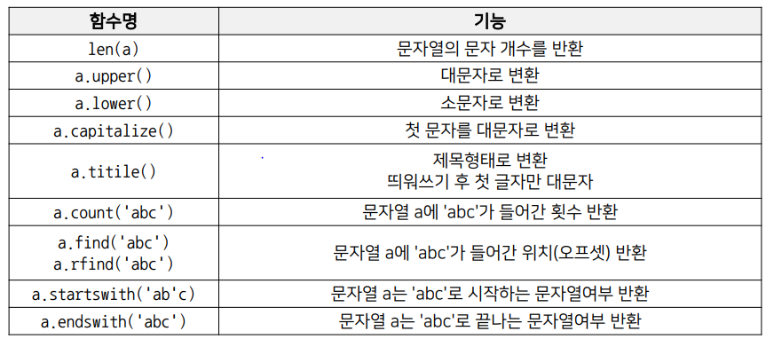
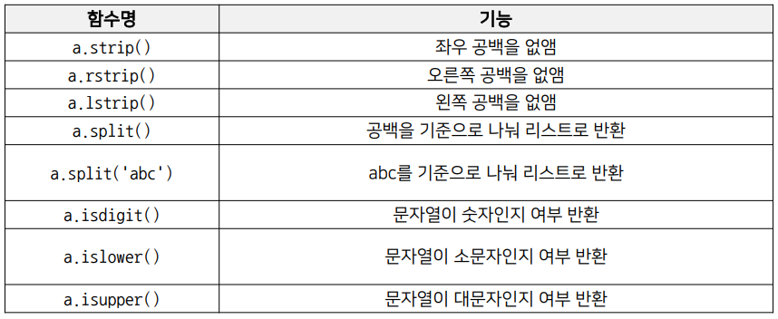

# Variables

> Variable & List


- a = 5  -> a(변수)에 5(값)을 넣어라
- 변수는 메모리 주소를 가지고 있고 값은 메모리 주소에 할당됨.
- 변수명은 의미있는 단어로 표기 약자는 지양


- data type에따라 메모리공간 차지량이 달라짐
- 연산자(Operator)와 피연산자(Operand)가 있고, 문자간에도 + 연산가능 -> concatenate


- 실수형에서 정수형으로 형 변환시 소수점 이하 내림


- List는 시퀸스 자료형, 여러가지 타입의 데이터가 들어갈 수 있음.

- List에 있는 값들은 주소(offset)을 가짐 indexing 가능

- 값들을 잘라서 쓰는 slicing

- ```
  print(List[::-1]) 뒤부터 역으로 슬라이싱
  ```

- concatenation 이 가능하다

- number.remove(5) ->가장 앞에있는 5 삭제

- del number[0]  -> 0번째 주소 리스트 객체 삭제

- 1차원은 copy가능하지만 2차원부터는 안된다. (copy.deepcopy 사용)


# Function and Console I/O

> 어떤 일을 수행하는 코드의 덩어리


- 캡슐화: 인터페이스만 알면 타인의 코드 사용
- 함수이름, parameter, indentation, return value(optional)
- parameter유무 반환값 유무에따라 함수의 형태가 다름


- input() 과 print()사용

- formatting(% string, format함수, fstring)

- %5d -> 5자리확보 정수형, %8.2f  -> 8자리 확보 소수점 둘째 자리까지 표시

- ```python
  name = "lee"
  number = 1.23456789
  print(f"Hello, {name}.")
  print(f"{name:20}")
  print(f"{name:*>20}")
  print(f"{number:>20.2f}")
  ```


# Conditionals and Loops

> 프로그램 작성 시, 조건에  따른 판단과 반복은 필수


- 조건문은 조건을 나타내는 기준 / 실행해야 할 명령 으로 구성됨
- x == y 는 값을비교 x is y 는 메모리 주소를 비교 -5~256 까지는 메모리에 기본적으로 저장되기 때문에 is를 써도 작동한다.
- 숫자형은 존재하면 참 없으면 거짓이라고 판단(0일경우에도 거짓) 문자열도 마찬가지로 "abc"는 참 ""는 거짓
- 조건을 두개 동시에 적는것보다는 and를 사용하는것이 좋다.
- List 앞에 붙여서 all은 and , any 는 or 의 역할을 함
- 삼항연산자(Ternary operators) - True Value / if condition else / False Value


- 반복문은 반복 시작 조건 / 종료 조건 / 수행 명령 으로 구성됨
- 반복 횟수가 명확할 때 for를 명확하지 않을 때 while을 사용
- range(10, 1, -1): 10부터 역순으로 2까지


- print문을 활용하여 디버깅을 함


- 문법적 오류를 찾기위한 오류 메시지 분석

- 논리적 에러를 찾기위해 print문을 활용

- ```python
  if __name__ =='__main__':
      코드
  ```

- _ _ name _ _은 모듈의 이름이 저장되는 변수고 import로 모듈을 가져왔을 때 모듈의 이름이 값으로 들어간다.

- 하지만 파이썬 인터프리터로 스크립트 파일을 직접 실행하면 '_ _ main _ _'이 값으로 들어가게된다.

-  add.py

- ```python
  def addition(x, y):
      return x + y
  
  if __name__ == '__main__':
      print(addition(10, 5))
  ```

- python add.py로 실행시키면 15가 찍히지만 import add로 불러왔을 때는 print문이 실행되지 않음


- stack overflow활용 혼자 문제 해결하기


# String and advanced function concept


- 시퀸스 자료형으로 문자형 data를 메모리에 저장

- 컴퓨터는 문자포함 모든 데이터를 이진수로 인식 영문자의경우 1byte를 차지함

- 문자를 이진수로 변환하는 표준 규칙을 정함(ex UTF-8)

- 문자열의 각 문자는 개별주소(offset)을 가져 인덱싱이 가능함(List와 같은 형태)

- in 명령어로 포함여부 체크

- 

- 

- ```
  raw_string = r"가나다라\n마바사"
  ```


- swap시 주의.  함수안에서 바깥의 변수는 되도록 건드리지 않도록 함


- ```python
  def type_hint_example(name: str) -> str:
      return f"Hello, {name}"
  ```


- docstring - 함수에 대한 사전 설명으로 사용자가 쉽게 이해가능
- black 모듈을 사용하여 pep8 에 근접하게 수정 가능


- 함수 작성 가이드라인
- - 함수는 가능하면 짧게 이름은 VO로 역할,의도가 명확하게
  - 인자로 받은 값 자체를 바꾸지 말 것
  - 사람이 이해할 수 있게 짜는게 중요(코딩 컨벤션)

