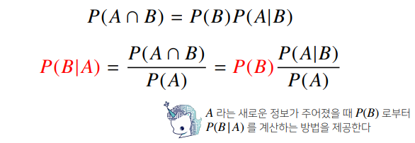
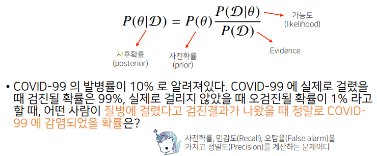

# 베이즈 통계학 맛보기

> 베이즈 정리는 조건부확률을 이용하여 정보를 갱신하는 방법을 알려준다

- 
- 
- P(D)는 검진결과가 양성일 확률 P(theta)는 감염이 됐을 확률
- 양성판정을 받았다는 조건하에 감염이 된사람일 확률을 사후확률로 구하는 문제다
- 데이터 갱신을 통해 사전확률을 높힐 수 있으므로 정확도를 높일 수 있다.
- 조건부 확률을 인과관계를 추론할 떄 함부로 사용하면 안된다
- 중첩요인의 효과를 제거하지 않으면 가짜 연관성이 나오기 때문

