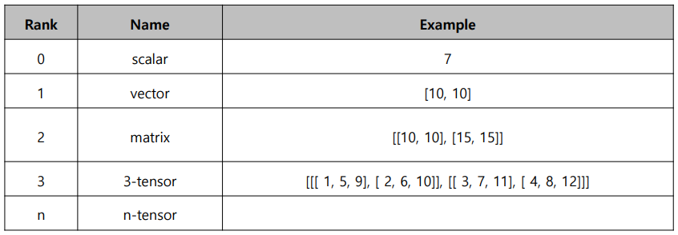

# numpy

> 파이썬의 고성능 과학 계산용 패키지(Numerical Python)
>
> Matrix와 Vector같은 Array 연산의 사실상의 표준


- 다양한 Matrix계산을 만들기 위해 / 굉장히 큰 Matrix에 대한 표현 / 처리속도 문제

- 적절한 패키지를 활용한다.

- - numpy의 array는 list에 비해 빠르고 메모리 효율적
  - 반복문 없이 데이터 배열에 대한 처리를 지원

- ndarray는 하나의 타입의 데이터만 배열에 넣을 수 있다.(dynamic typing 지원하지 않는다)

- ndarray는 메모리에 값이 순서대로 쌓인다. / 

- list는 -5~256까지의 값이 메모리 어딘가에 있다. 메모리 주소가 쌓인다.(한번더 들어가야함)

- ndarray는 메모리의 위치가 일정하여 연산에서 큰 장점을 얻고 list는 변형이 쉽다.

- shape과 dtype은 property(함수를 변수처럼 쓴다 괄호를 안적어도 됨)고 값을 변화시키진 않음

- array의 rank에 따라 이름이다르다.

- - 

- reshape에서 -1 은 나머지 shape을 맞춰주고 자동으로 남는 숫자를 찾아줌 -1을 두개이상 쓸 수 없음

- indexing / slicing 행과 열부분을 나눠서 가능함 , 사용

- ```python
  test_matrix = [[1,2,3,4],
                 [5,6,7,8],
                 [1,2,3,4],
                 [5,6,7,8]]
  np.array(test_matrix)[1,:2]        # [5 6]  2차원 벡터
  np.array(test_matrix)[1:2,:2]      # [[5 6]] 1 x 2 행렬의 형태 유지
  ```

- ```python
  np.ones(shape, dtype, order)  #order는 row-major 'C' / 'F'
                                #dtype은 np를 붙여서 ex)np.int8
  ```

- ```python
  np.eye(3) #=np.identity(n=3)
  np.eye(3, 5, k=2) #[[0. 0. 1. 0. 0.]
                    # [0. 0. 0. 1. 0.]
                    # [0. 0. 0. 0. 1.]]
  print(np.eye(3,5,k=-1) #[[0. 0. 0. 0. 0.] -1이면 0의 왼쪽부터 시작했다고 생각
                         # [1. 0. 0. 0. 0.] -2의경우 [2, 0] 에만 1이찍힘
                         # [0. 1. 0. 0. 0.]]
  np.diag(matrix, k=1)   # 대각선을 추출 k의 활용은 같음
  ```

- ```python
  test_array = np.array([1,2,3,4,5,6,7,8,9,10,11,12])
  test_array = test_array.reshape(-1,2,2)
  test_array
  [[[ 1,  2],
     [ 3,  4]],
  
    [[ 5,  6],
     [ 7,  8]],
  
    [[ 9, 10],
     [11, 12]]]
  test_array.sum(axis=2)
  test_array.sum(axis=1)
  test_array.sum(axis=0)
  ```

- ```python
  test_array.T              #property?
  test_array.transpose()
  ```

- brodcasting : shape이 다른 배열간 연산을 지원하는 기능 (늘려준다.)

- array도 index value로 사용할 수 있음

- ```
  a = np.array()
  b = np.array() #인덱스로 사용해야하므로 int로 해야함
  a[b]
  a.take(b)   #두개 모두 같은 의미
  ```

- 

