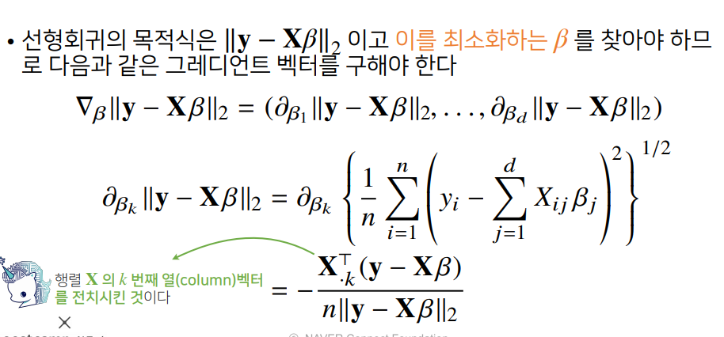
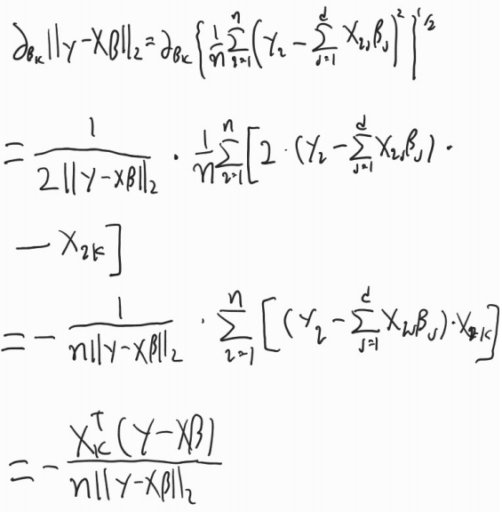

# 경사하강법(순한맛)

- 미분값을 x에 더해주면서 극대값을 찾는게 경사상승법(gradient ascent)
- 반대로 미분값을 x에서 빼주면서 극소값을 찾는게 경사하강법(gradient descent)

- 변수가 벡터일 경우 즉 다변수 함수의 경우 편미분(partial differentiation)을 사용한다
- 그레디언트(gradient) 벡터를 이용하여 경사하강법에 사용할 수 있다

# 경사하강법(매운맛)

- 
- 이렇게 풀 수 있고, 처음에 그레디언트를 노름의 제곱을 해서 구하면 조금 더 깔끔한 식이 나온다.

- 경사하강법은 미분 가능하고 볼록(convex)한 함수에 대해서는 수렴이 보장되지만 그렇지 않은경우(비선형 회귀)에는 활용하기 애매하다. 극소값이 최소값이라고 보장 할 수 없기 때문이다.

- 이때 확률적 경사하강법(stochastic gradient desent)를 사용한다.
- 데이터 전부를 사용해 그레디언트를 구하지 않고 랜덤하게 데이터의 일부를(원래는 하나지만 mini-batch sgd 에선 b개의 데이터를 ) 사용해 그레디언트를 구한다.
- 일반적인 경사하강법과 유사하게 최소점을 향해서 가지만 데이터를 랜던하게 일부만 뽑아서 사용하기 때문에 목적식이 계속 조금씩 달라진다
- 따라서 연산의 속도가 더 빠르고(b/n) 최소값이 아닌 극소값에서 경사하강법이라면 수렴할 수 있지만 sgd는 확률적으로 탈출이 가능하기 때문에 효율적이다.(볼록이 아닌 목적식에서도 사용이 가능)